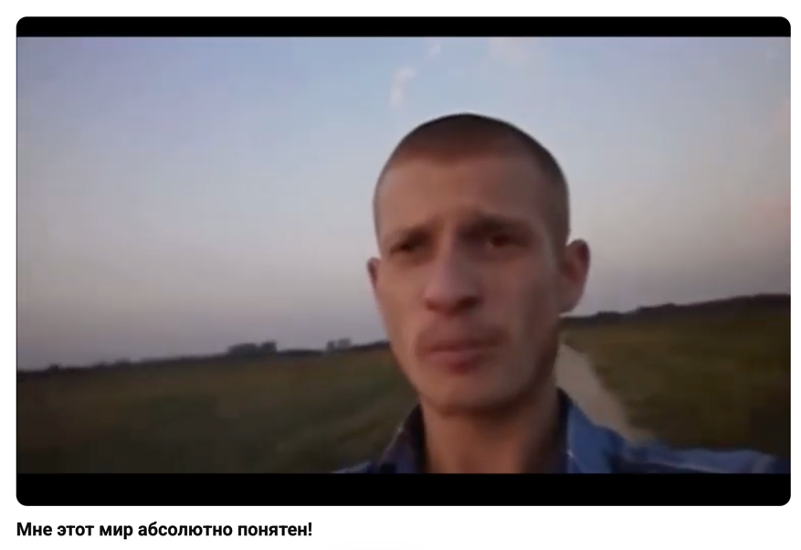
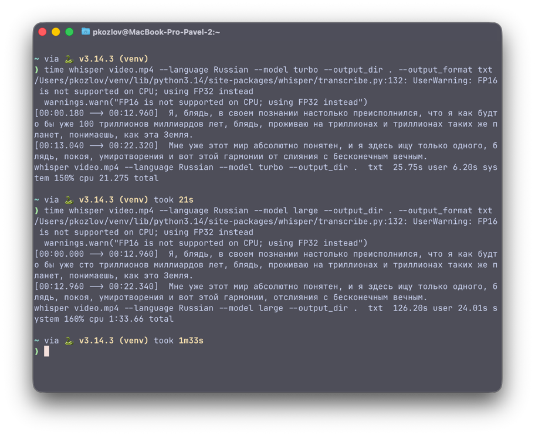
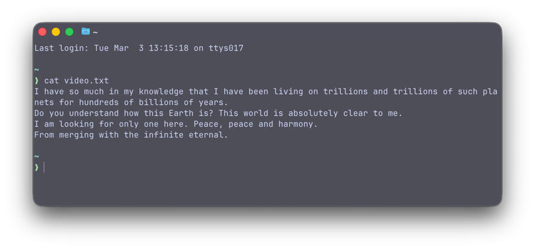
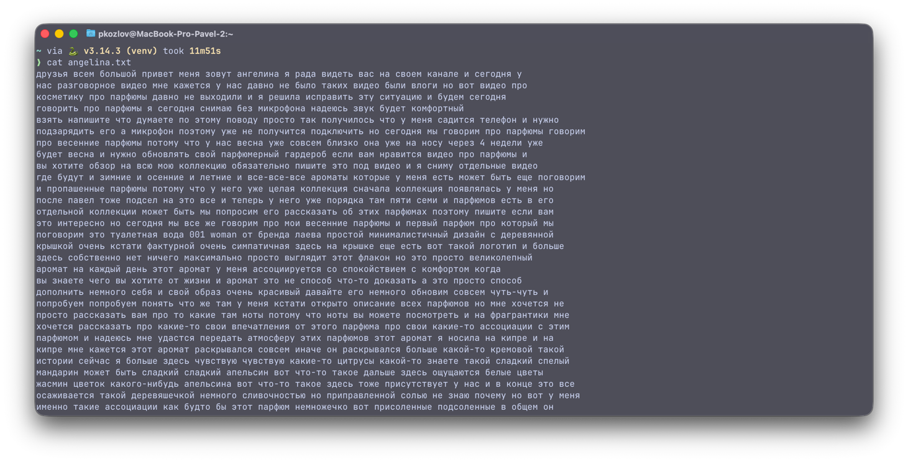
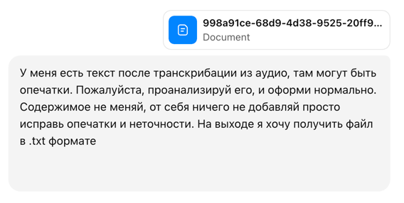
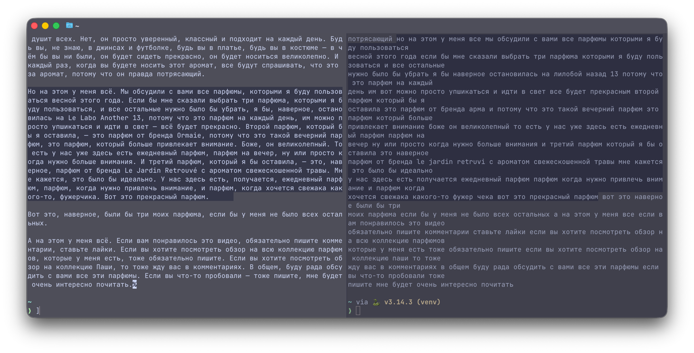
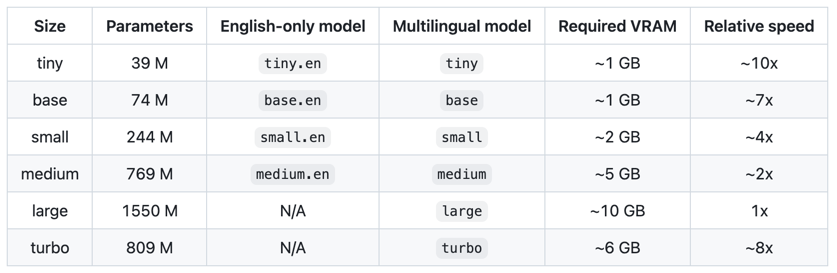

# Whisper. Транскрибация аудио локальной моделью

Привет! Решил попробовать поиграть с AI модельками. Взял библиотеку whisper от OpenAI (создатели chatGPT). Давайте
посмотрим что она умеет.

[Репозиторий с исходным кодом](https://github.com/openai/whisper)

## Что это вообще такое? 

Whisper — это универсальная модель распознавания речи. Она обучена на большом наборе данных разнообразных аудиофайлов и
является многозадачной моделью, способной выполнять многоязычное распознавание речи, перевод речи и идентификацию языка.

## Выбор видео

Взял мемное [видео](https://www.youtube.com/watch?v=E1CvKih550o), скачал его себе на ноутбук с помощью [первого найденного сервиса](https://app.ytdown.to/ru10/).



## Запуск модельки

И поехал по инструкции:

Создал дирректорию для проекта, переместился в нее, создал виртуальное окружение для питонячей среды, что бы не засирать
основную систему, активировал его (приходилось годик писать на питоне, не удивляйтесь). 

```shell
mkdir whisper && cd whisper
python3 -m venv venv
source venv/bin/activate
```

Обновил питоновский менеджер пакетов, установил необходимые утилиты.

```shell
pip install --upgrade pip
pip install -U openai-whisper
pip install setuptools-rust
```

Установил в систему `ffmpeg`. Это `open-source` утилита для работы с медиа. На самом деле она уже была установлена на
моем ноутбуке

```shell
brew install ffmpeg
```

Пора запускать

```shell
whisper video.mp4 --model turbo
```

```terminaloutput
❯ whisper video.mp4 --model turbo
/Users/pkozlov/venv/lib/python3.14/site-packages/whisper/transcribe.py:132: UserWarning: FP16 is not supported on CPU; using FP32 instead
  warnings.warn("FP16 is not supported on CPU; using FP32 instead")
Detecting language using up to the first 30 seconds. Use `--language` to specify the language
Detected language: Russian
[00:00.180 --> 00:12.960]  Я, блядь, в своем познании настолько преисполнился, что я как будто бы уже 100 триллионов миллиардов лет, блядь, проживаю на триллионах и триллионах таких же планет, понимаешь, как эта Земля.
[00:13.040 --> 00:22.320]  Мне уже этот мир абсолютно понятен, и я здесь ищу только одного, блядь, покоя, умиротворения и вот этой гармонии от слияния с бесконечным вечным.
```

Из интересного:
- `Detecting language using up to the first 30 seconds. Detected language: Russian`, он по первым 30 секундам понял что 
у меня русский язык в видосе и не пришлось явно указывать.
- Модель `turbo` скачалась сама, довольно быстро, и сделала точную транскрибацию с таймингами.

Поискал в доке какие еще есть модели. 

|  Size  | Parameters | English-only model | Multilingual model |  
|:------:|:----------:|:------------------:|:------------------:|
|  tiny  |    39 M    |         ✓          |         ✓          |
|  base  |    74 M    |         ✓          |         ✓          |
| small  |   244 M    |         ✓          |         ✓          |
| medium |   769 M    |         ✓          |         ✓          |
| large  |   1550 M   |                    |         ✓          |
| turbo  |   798 M    |                    |         ✓          |

Давайте попробуем самую жирную модельку, и явно укажем язык! 

```terminaloutput
❯ whisper video.mp4 --language Russian --model large
100%|█████████████████████████████████████| 2.88G/2.88G [02:07<00:00, 24.2MiB/s]
/Users/pkozlov/venv/lib/python3.14/site-packages/whisper/transcribe.py:132: UserWarning: FP16 is not supported on CPU; using FP32 instead
warnings.warn("FP16 is not supported on CPU; using FP32 instead")
[00:00.000 --> 00:12.960]  Я, блядь, в своем познании настолько преисполнился, что я как будто бы уже сто триллионов миллиардов лет, блядь, проживаю на триллионах и триллионах таких же планет, понимаешь, как это Земля.
[00:12.960 --> 00:22.340]  Мне уже этот мир абсолютно понятен, и я здесь ищу только одного, блядь, покоя, умиротворения и вот этой гармонии, отслияния с бесконечным вечным.
```

Модель весила 2.88 ГБ, скачалась и сделала в целом тоже самое.

Далее я попробовал все это дело сохранить куда нибудь, что бы не потерять при закрытии терминала.

```shell
whisper video.mp4 --language Russian --model turbo --output_dir . --output_format txt

```

```terminaloutput
❯ cat video.txt
Я, блядь, в своем познании настолько преисполнился, что я как будто бы уже 100 триллионов миллиардов лет, блядь, проживаю на триллионах и триллионах таких же планет, понимаешь, как эта Земля.
Мне уже этот мир абсолютно понятен, и я здесь ищу только одного, блядь, покоя, умиротворения и вот этой гармонии от слияния с бесконечным вечным.
```

Магия произошла, все сохранилось в текстовый файл. Там еще есть куча форматов для сохранения, можно и в `json`, и вообще
в чем только не можно. 

## Бенчмарки

Запускал на личном MacBook Pro 2020 M1 16 ГБ ОЗУ. 



`turbo` отработала за 21 секунду.
`large` отработала за 1 минуту 33 секунды.

## Перевод текста

Детектить язык уже увидели что умеет. Транскрибацию (преобразование аудио в текст) тоже заценили. Заявлено что и в 
перевод тоже умеет. Правда только на английский. Давайте проверим:

```shell
whisper video.mp4 --language Russian --model large --task translate --output_dir . --output_format txt
```

```
I have so much in my knowledge that I have been living on trillions and trillions of such planets for hundreds of billions of years.
Do you understand how this Earth is? This world is absolutely clear to me.
I am looking for only one here. Peace, peace and harmony.
From merging with the infinite eternal.
```



Очень бодро!

## Нагрузим посерьезнее


Прошлый ролик длился 22 секунды, и как будто слишком просто. Я взял [видео](https://www.youtube.com/watch?v=oGBU4FxNZy8)
моей жены про парфюмы, динной 26 минут 46 секунд и решил прогнать `turbo` моделью. Заняло 11 минут 51 секунду.



## А как это использовать потом? Для чего это нужно?

Давайте попробуем пойти дальше. Я попросил ChatGPT с моделью 5.2 Thinking почистить полученный текст. 



Три с половиной минуты подумав, мой нейросетевой друг выдал мне исправленную версию. Вы просто посмотрите какая красота
(слева исправленная версия, справа оригинал):



Мы буквально из этого:

```
друзья всем большой привет меня зовут ангелина я рада видеть вас на своем канале и сегодня у
нас разговорное видео мне кажется у нас давно не было таких видео были влоги но вот видео про
косметику про парфюмы давно не выходили и я решила исправить эту ситуацию и будем сегодня
говорить про парфюмы я сегодня снимаю без микрофона надеюсь звук будет комфортный
взять напишите что думаете по этому поводу просто так получилось что у меня садится телефон и нужно
подзарядить его а микрофон поэтому уже не получится подключить но сегодня мы говорим про парфюмы говорим
про весенние парфюмы потому что у нас весна уже совсем близко она уже на носу через 4 недели уже
будет весна и нужно обновлять свой парфюмерный гардероб если вам нравится видео про парфюмы и
вы хотите обзор на всю мою коллекцию обязательно пишите это под видео и я сниму отдельные видео
где будут и зимние и осенние и летние и все-все-все ароматы которые у меня есть может быть еще поговорим
и пропашенные парфюмы потому что у него уже целая коллекция сначала коллекция появлялась у меня но
после павел тоже подсел на это все и теперь у него уже порядка там пяти семи и парфюмов есть в его
отдельной коллекции может быть мы попросим его рассказать об этих парфюмах поэтому пишите если вам
это интересно
```

Получили это:

```
Друзья, всем большой привет! Меня зовут Ангелина. Я рада видеть вас на своём канале, и сегодня у нас разговорное видео. Мне кажется, у нас давно не было таких видео: были влоги, но вот видео про косметику, про парфюмы давно не выходили. И я решила исправить эту ситуацию. Будем сегодня говорить про парфюмы.

Я сегодня снимаю без микрофона, надеюсь, звук будет комфортный. Напишите, что думаете по этому поводу. Просто так получилось, что у меня садится телефон, и нужно подзарядить его, а микрофон поэтому уже не получится подключить.

Но сегодня мы говорим про парфюмы, говорим про весенние парфюмы, потому что у нас весна уже совсем близко, она уже на носу: через 4 недели уже будет весна, и нужно обновлять свой парфюмерный гардероб.

Если вам нравятся видео про парфюмы и вы хотите обзор на всю мою коллекцию, обязательно пишите это под видео, и я сниму отдельное видео, где будут и зимние, и осенние, и летние, и все-все-все ароматы, которые у меня есть. Может быть, ещё поговорим и про Пашины парфюмы, потому что у него уже целая коллекция. Сначала коллекция появлялась у меня, но потом Павел тоже подсел на это всё, и теперь у него уже порядка пяти-семи парфюмов есть в его отдельной коллекции. Может быть, мы попросим его рассказать об этих парфюмах, поэтому пишите, если вам это интересно.
```

### Давайте пойдем еще дальше

...И заставим компьютер с нами поговорить. Я решил попробовать [Piper](https://github.com/OHF-Voice/piper1-gpl), это tts
(text to speech) модель, которая можно так же запустить локально, и она переведет текст в звук. По сути мы уже перевели
звук в текст, и я хочу вернуть обратно, но другим голосом. `Piper` поддерживает русский в том числе. 

Установим, в тоже самое виртуальное окружение:

```shell
pip install piper-tts
```

Скачаем голоса (я решил поставить и мужской, и женский):

```shell
python3 -m piper.download_voices ru_RU-dmitri-medium
python3 -m piper.download_voices ru_RU-irina-medium
```

Библиотека голосов находится [тут](https://rhasspy.github.io/piper-samples/), можно выбрать язык, спикера и качество.

Запустим для проверки с тестовой фразой:

`Python` ругнулся с ошибкой:

```
Traceback (most recent call last):
  File "<frozen runpy>", line 198, in _run_module_as_main
  File "<frozen runpy>", line 88, in _run_code
  File "/Users/pkozlov/venv/lib/python3.14/site-packages/piper/__main__.py", line 13, in <module>
    from pathvalidate import sanitize_filename
ModuleNotFoundError: No module named 'pathvalidate'
```

Но ее легко исправить через доустановку необходимых зависимостей: `pip install pathvalidate`

```shell
python3 -m piper -m ru_RU-irina-medium -f test.wav -- 'Это просто тест.'
```

И о чудо, голос звучит!

<audio controls preload="metadata" style="width:100%">
  <source src="test.wav" type="audio/mpeg">
</audio>

Запустим для нашего исправленного файла:

```shell
time python3 -m piper -m ru_RU-irina-medium -f angelina-irina.wav --input-file edited_transcript.txt
```

49 секунд, и аудио длинной 23 минуты и 50 секунд готово. Голос немного роботизированный, сильно себя выдает, за человека 
не сойдет. Но очень понятно говорит, быстро все отработало.

<audio controls preload="metadata" style="width:100%">
  <source src="angelina-irina.wav" type="audio/mpeg">
</audio>

Попробуем все это в мужской голос перевести:

```shell
python3 -m piper -m ru_RU-dmitri-medium -f angelina-dmitri.wav --input-file edited_transcript.txt
```

И теперь файл длится 17 минут и 16 секунд. Дима явно говорит быстрее Ирины. 

<audio controls preload="metadata" style="width:100%">
  <source src="angelina-dmitri.wav" type="audio/mpeg">
</audio>

### Ну и на последок, давайте послушаем английский

Не зря мы перевели идущего к реке и получили этот шедевр:

```
I have so much in my knowledge that I have been living on trillions and trillions of such planets for hundreds of billions of years.
Do you understand how this Earth is? This world is absolutely clear to me.
I am looking for only one here. Peace, peace and harmony.
From merging with the infinite eternal.
```

Пусть поговорит на английском!

```
python3 -m piper.download_voices en_US-john-medium
python3 -m piper -m en_US-john-medium -f english.wav --input-file video.txt
```

И наконец, сведем это все в видео с помощью `ffmpeg`, удалив из оригинального видео аудиодорожку, подставив нашу:

```shell
ffmpeg -i video.mp4 -i video.wav -c:v copy -map 0:v:0 -map 1:a:0 -shortest eng_video.mp4
```

На английском:

<video controls playsinline preload="metadata" width="100%">
  <source src="whisper_eng_video.mp4" type="video/mp4">
</video>

Оригинал:

<video controls playsinline preload="metadata" width="100%">
  <source src="video.mp4" type="video/mp4">
</video>

Я считаю это потрясающе! 

## Системные требования



Что бы гонять самую большую модельку, потребуется 10 гигов видеопамяти. 

## Вывод

Было довольно интересно попробовать локальные модельки, это первый мой опыт. Получилось перевести видео в текст, затем 
обратно текст в аудио, при чем на другом языке и другими голосами. Потенциал у всего этого прикольный. Обязательно буду 
пробовать еще. Всем спасибо что прочитали